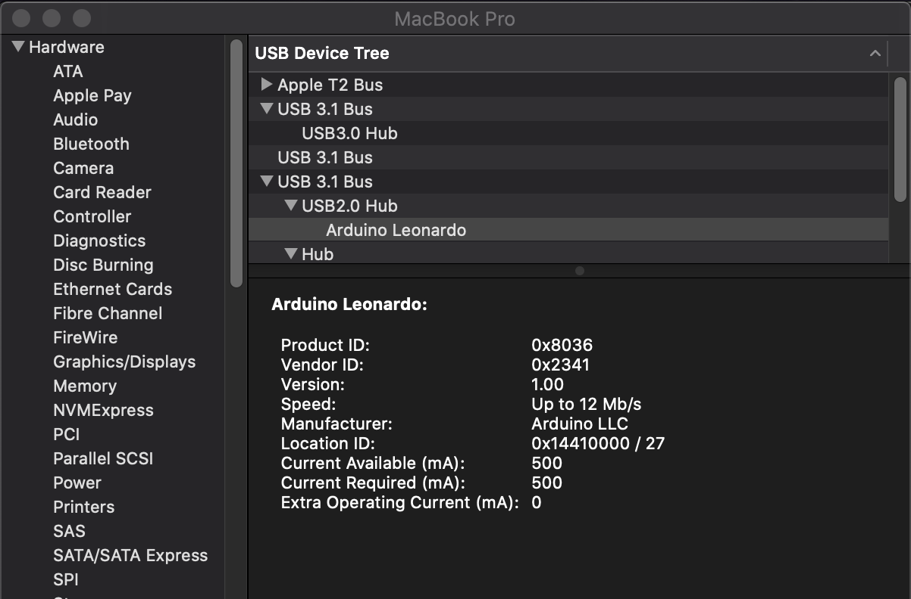

# Debug and Test Stepper Motors for WebUSB-enabled devices

> Stepper Motor example is based on https://github.com/kalaschnik/stepper-motor-debugging
>
> 💡 As of fall 2022, WebUSB is still Chromium-only thing: https://caniuse.com/webusb — But it also works an Chrome for Android on your phone/tablet!
>
> 💡 To make Arduino IDE WebUSB-ready, follow the instructions here: https://github.com/webusb/arduino

# Demos

## Stepper Motor Demo

https://user-images.githubusercontent.com/9831678/197196978-e85834dd-4a2c-4367-b6c6-197893818062.mp4

1. Upload [webusb-stepper-motor.ino](/src/webusb-stepper-motor/webusb-stepper-motor.ino) to your [WebUSB-enabled device](#resources)
2. Go to https://ccp-odc.eva.mpg.de/webusb/
3. Click Connect and select your device
4. Follow the UI

## LED Demo

1. Upload [led-demo.ino](/src/led-demo/led-demo.ino) to your [WebUSB-enabled device](#resources)
2. Go to https://ccp-odc.eva.mpg.de/webusb/
3. Click Connect and select your device
4. Follow the UI

# Development

https://developer.mozilla.org/en-US/docs/Web/API/USB

## Getting Device IDs

Use either `lsusb` (Linux) `system_profiler SPUSBDataType` (macOS). Or System Information App on macOS:


💡 Note that this also includes non-WebUSB devices! For compatibilty check [Resources](#resources) section.

### `getDevices()` — WebUSB API

```js
navigator.usb.getDevices().then((devices) => {
	console.log(`Total devices: ${devices.length}`);
	devices.forEach((device) => {
		console.log(
			`Product name: ${device.productName}, serial number ${device.serialNumber}`
		);
	});
	console.log(devices);
});
```

- `getDevices()` method of the USB interface returns a Promise that resolves with an array of USBDevice objects for paired attached devices. **Device ids are provided as integers**
- System Information App shows **device ids as hex codes**

## Request a device via ID

The `requestDevice(filters)` method of the USB interface returns a Promise that resolves with an instance of USBDevice if the specified device is found. Calling this function triggers the user agent's pairing flow.

You need to provide a filter array of objects [{}]. You can query the following properties: `vendorId, productId, classCode, subclassCode, protocolCode, serialNumber`

### `requestDevice()` — WebUSB API

Request a device with a specific vendorID

```js
navigator.usb
	.requestDevice({ filters: [{ vendorId: 9025 }] })
	.then((device) => {
		console.log(device);
	});
```

Get a list of all connected Devices (empty array of objects)

```js
navigator.usb.requestDevice({ filters: [{}] }).then((device) => {
	console.log(device);
});
```

### Notes

- Device IDs can be provided in hex (0x2341) or as integer (i.e., 9025)

# Resources

- Spec: https://wicg.github.io/webusb/
- Arduino w/ compatible Hardware (Processors are ATmega32U4 or SAMD21): https://github.com/webusb/arduino
